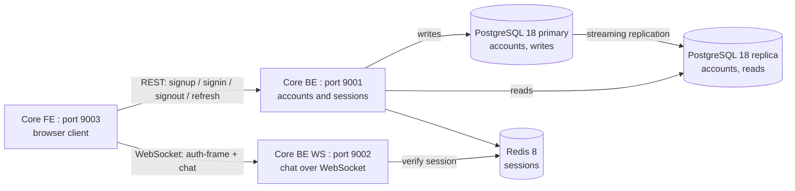
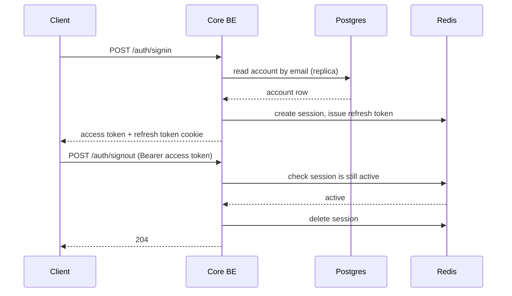

# High-Level Design: Core BE

 

## System context

Core BE is one of three services in the chat-bot product:

Core BE owns account creation and session lifecycle. It is the only service allowed to write to the accounts table and the only service that issues JWTs. Core BE WS trusts those JWTs by checking the signature against a secret shared between the two services, and confirms the session is still active by reading the same Redis instance Core BE writes to.

 

## Responsibilities

- Create accounts with a hashed password, no email verification or OTP.
- Verify credentials on signin and start a session.
- Issue short-lived access tokens (JWT, 15 minutes).
- Track sessions in Redis so signout revokes access immediately, instead of waiting for the token to expire.
- Rotate refresh tokens on every use so a leaked refresh token stops working after its next legitimate use.
- Report its own health and the exact commit running, for both local debugging and deployment verification.

 

## What it does not do

- It does not talk to the DeepSeek chat model, that is Core BE WS.
- It does not serve any frontend assets, that is Core FE.
- It does not validate email format or send verification emails, out of scope per spec.

 

## Request flow: signin then a protected call

 

## Dependencies

- PostgreSQL 18: one primary and one streaming replica. Writes (signup) go to the primary, reads (signin lookup) go to the replica.
- Redis 8: session records (`sid -> accountId`) and refresh token records, both with a TTL matching the refresh token lifetime.
- Shared JWT secret with Core BE WS: Core BE issues, Core BE WS only verifies.
